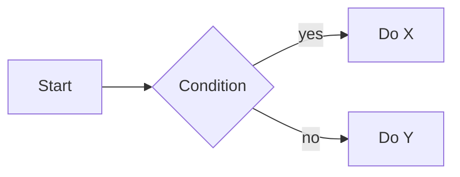

# Bilder, Zeichnungen, Diagramme

Ziehen, ablegen, fertig. Aber einige Bildfunktionen von Eduskript gehen über die Grundlagen hinaus — themenabhängige Excalidraw-Zeichnungen, die mit dem Hell-/Dunkelmodus wechseln (inklusive KI-generierter Diagramme), eine kuratierte Farbpalette, die in beiden Themen lesbar bleibt, `invert` für handgezeichnete Schwarz-auf-Weiss-Skizzen und Mermaid für Diagramme, die du lieber beschreibst als zeichnest.

---

## Bilder hinzufügen

### Drag-and-Drop

Ziehe eine beliebige Bilddatei (PNG, JPG, WebP, GIF, SVG) in den Editor. Sie wird in den Dateispeicher deines Skripts hochgeladen, und das Markdown wird automatisch an deinem Cursor eingefügt.

### Markdown-Syntax

```markdown

```

Der Alt-Text wird zur sichtbaren Bildunterschrift unter dem Bild. Schreibe für die Barrierefreiheit etwas Beschreibendes — Schülerinnen und Schüler mit Screenreadern sind darauf angewiesen.

### HTML-Syntax mit Attributen

Für mehr Kontrolle verwendest du den `<image>`-Tag:

```html
<image src="my-image.png" width="50%" align="right" wrap />
```

| Attribut | Werte | Wirkung |
|-----------|--------|--------|
| `src` | Dateiname oder URL | Bildquelle (erforderlich) |
| `alt` | String | Alt-Text / Bildunterschrift |
| `width` | %, px | Bildbreite setzen |
| `align` | `left`, `center`, `right` | Horizontale Ausrichtung |
| `wrap` | (boolesch) | Bild schweben lassen, sodass Text darum herumfliesst |
| `invert` | (boolesch) | Im Dunkelmodus automatisch invertieren (ideal für handgezeichnete Skizzen) |
| `saturate` | Zahl | Farbsättigung anpassen |

Wenn du in der Live-Vorschau über ein Bild fährst, erscheinen Griffe zum Skalieren und eine Ausrichtungs-Symbolleiste — meist schneller als Attribute zu tippen.

---

## Excalidraw — themenabhängige Diagramme

[Excalidraw](https://excalidraw.com) ist ein Skizzenwerkzeug mit handgezeichneter Ästhetik. Eduskript integriert es tief — inklusive eingebautem Editor (ohne die Seite zu verlassen) und **automatischem Themenwechsel**: Du lieferst ein SVG für den Hellmodus und eines für den Dunkelmodus, und Eduskript liefert je nach Thema des Schülers das richtige aus.

### Der schnelle Weg: Editor in der Seite

Klicke auf den **Excalidraw-Button** in der Symbolleiste → eine Zeichenfläche öffnet sich direkt in der Seite. Skizziere dein Diagramm, klicke auf Save. Eduskript:

1. Erzeugt zwei SVGs (helles und dunkles Thema)
2. Lädt beide in deine Skript-Dateien hoch
3. Fügt die Markdown-Referenz für dich ein

Das ist der ganze Ablauf. Die Zeichnung bleibt bearbeitbar — klicke sie später in der Vorschau an, um den Editor erneut zu öffnen.

### Ein Diagramm aus einem Prompt erzeugen

Der Excalidraw-Editor in der Seite kann auch einen ersten Entwurf aus einem KI-Prompt erzeugen — beschreibe das gewünschte Diagramm, lass die KI es skizzieren, und passe das Ergebnis dann von Hand an wie jede andere Excalidraw-Zeichnung.

### Der manuelle Weg: externes Excalidraw

Wenn du die eigenständige Web-App oder Desktop-App von Excalidraw bevorzugst:

1. Zeichne dein Diagramm auf [excalidraw.com](https://excalidraw.com)
2. **Export → SVG** mit hellem Thema → speichern als `mydiagram.excalidraw.light.svg`
3. Schalte die Zeichenfläche auf das dunkle Thema um, exportiere erneut → `mydiagram.excalidraw.dark.svg`
4. Lade beide Dateien in dein Skript hoch
5. Referenziere sie im Markdown:

```markdown

```

Eduskript sucht die Geschwisterdateien `.light.svg` / `.dark.svg` automatisch. Die `.excalidraw`-Referenz ist symbolisch — es gibt keine tatsächliche `.excalidraw`-Datei (nur die zwei SVGs).

### Wann Excalidraw und wann andere Diagrammwerkzeuge

> [!example] Excalidraw glänzt bei
> - Algorithmus-Flussdiagrammen und Zustandsdiagrammen
> - Datenbank-ER-Diagrammen (werden neben SQL-Editoren automatisch erkannt — siehe *SQL-Datenbanken*)
> - Concept Maps und Mindmaps
> - Netzwerktopologien, UML-Klassendiagrammen
> - Allem, wo ein skizzenhafter, handgezeichneter Look besser passt als CAD-Präzision

> [!warning] Excalidraw ist weniger geeignet für
> - Fotos (nimm JPG)
> - Pixelgenaue Diagramme (nimm ein Vektorwerkzeug wie Figma oder Inkscape)
> - Sehr grosse Diagramme, die nicht in eine normale Seitenbreite passen

---

## Mermaid-Diagramme

Für Flussdiagramme, Sequenzdiagramme und andere strukturierte Diagramme rendert Eduskript auch [Mermaid](https://mermaid.js.org) nativ — eine textbasierte Diagrammsyntax, themenabhängig wie alles andere:

````markdown

````

Die meisten Lehrpersonen schreiben Mermaid-Syntax nicht von Hand. Beschreibe dem AI-Edit-Chat das gewünschte Diagramm — «zeichne ein Flussdiagramm des Algorithmus oben» — und er schreibt den ` ```mermaid `-Block für dich. Passe den erzeugten Code anschliessend an, falls er nicht ganz stimmt.

---

## Themenabhängige benannte Farben

Farben in Markdown sind eine Usability-Falle — `#00BFFF` sieht auf Weiss toll aus und verschwindet auf Schwarz. Eduskript liefert eine kuratierte **Farbpalette**, in der jede benannte Farbe eigene Werte für Hell- und Dunkelmodus hat, gewählt für Lesbarkeit in beiden.

### Im Fliesstext

Die Symbolleiste hat einen Textfarben- und Hervorhebungs-Wähler. Klicke entweder ein Farbfeld aus der Palette an oder schreibe die Spans von Hand:

```html
The result is <span class="es-color-cyan">42</span>, highlighted in
<span class="es-bg-yellow">yellow</span> for emphasis.
```

**Verfügbare Textfarben** (`es-color-*`): cyan, lightgreen, green, orange, red, blue, violet, purple, lightblue, pink, yellow, white, black, gray.

**Verfügbare Hervorhebungen** (`es-bg-*`): yellow, green, blue, pink, orange, red, purple.

Jede wechselt ihren Farbton automatisch, wenn der Schüler zwischen Hell- und Dunkelmodus umschaltet.

### In Mathematik (KaTeX)

Der KaTeX-Befehl `\textcolor` akzeptiert dieselben Farbnamen:

```latex
$$\textcolor{cyan}{x}^2 + \textcolor{orange}{y}^2 = \textcolor{lightgreen}{r}^2$$
```

Das rendert die Gleichung mit `x` in cyan, `y` in orange, `r` in lightgreen — und alle drei wechseln beim Themenwechsel zu ihren dunkelmodus-tauglichen Varianten.

> [!info] Eigene Hex-Farben
> Der «Custom color...»-Wähler der Symbolleiste erzeugt einen einfachen Inline-Style-Span mit festem Hex-Code. Das funktioniert, passt sich aber nicht dem Thema an — wähle aus der Palette, wenn du Lesbarkeit in beiden Themen willst.

---

## Handgezeichnete Skizzen im Dunkelmodus invertieren

Du hast ein Wandtafelfoto gescannt oder eine Skizze auf weisses Papier gezeichnet. Im Hellmodus sieht sie toll aus. Im Dunkelmodus ist sie ein grell weisser Block.

Lösung: `invert` hinzufügen:

```html
<image src="chalk-sketch.jpg" invert />
```

Im Dunkelmodus wird das Bild automatisch invertiert (Weiss wird dunkel, Schwarz wird hell). Funktioniert am besten bei kontrastreichen Schwarz-auf-Weiss-Inhalten wie Skizzen, gescannten Diagrammen und handschriftlichen Notizen.

---

## Unterstützte Formate

| Format | Am besten für |
|--------|----------|
| **PNG** | Screenshots, scharfe Grafiken mit Transparenz |
| **JPG** | Fotos, alles Grosse, das komprimiert werden soll |
| **WebP** | Besser komprimierte Fotos (moderne Browser) |
| **SVG** | Vektorgrafiken, Icons, Diagramme aus anderen Werkzeugen |
| **GIF** | Kurze Animationen |
| **Excalidraw** (`.excalidraw.light.svg` + `.excalidraw.dark.svg`) | Themenabhängige, bearbeitbare Diagramme |

Für Videos siehe das Kapitel **Video** — sie werden separat über Mux abgewickelt.

---

## Spickzettel Bilder und Diagramme

| Ziel | Syntax |
|------|--------|
| Zentriertes Bild mit Bildunterschrift | `` |
| Rechtsbündig mit 50% Breite | `<image src="file.png" width="50%" align="right" />` |
| Schwebend mit Textumfluss | `<image src="file.png" width="40%" align="left" wrap />` |
| Themenabhängiges Excalidraw-Diagramm | `` |
| KI-entworfenes Excalidraw-Diagramm | Excalidraw-Button in der Symbolleiste → im Prompt beschreiben |
| Mermaid-Diagramm | ` ```mermaid `-Code-Block, oder AI Edit bitten, einen zu schreiben |
| Handgezeichnete Skizze (automatisch invertiert im Dunkelmodus) | `<image src="sketch.png" invert />` |
| Inline-Textfarbe, themenabhängig | `<span class="es-color-cyan">text</span>` |
| Inline-Hervorhebung, themenabhängig | `<span class="es-bg-yellow">text</span>` |
| Mathematik mit themenabhängiger Farbe | `$\textcolor{orange}{x}$` |
